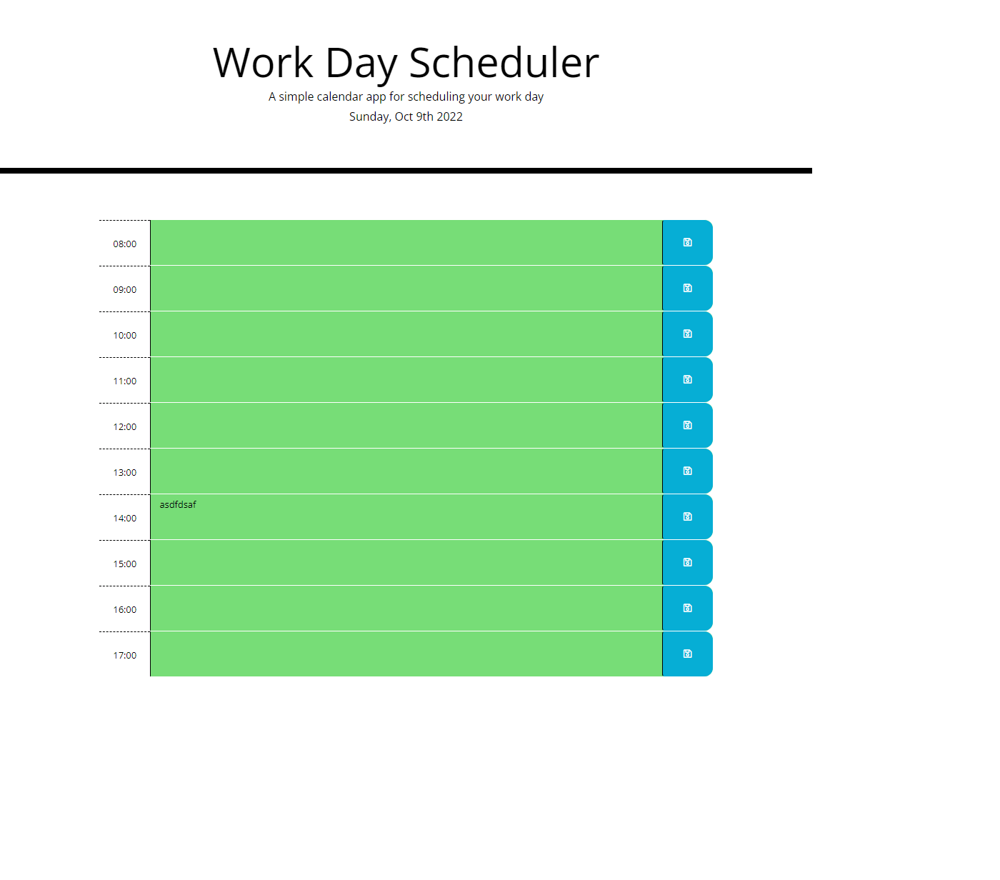

# challenge5


## Your Task

Create a simple calendar application that allows a user to save events for each hour of the day by modifying starter code. This app will run in the browser and feature dynamically updated HTML and CSS powered by jQuery.

You'll need to use the [Moment.js](https://momentjs.com/) library to work with date and time. Be sure to read the documentation carefully and concentrate on using Moment.js in the browser.

## User Story

```md
AS AN employee with a busy schedule
I WANT to add important events to a daily planner
SO THAT I can manage my time effectively
```

## Acceptance Criteria

```md
GIVEN I am using a daily planner to create a schedule
WHEN I open the planner
THEN the current day is displayed at the top of the calendar
WHEN I scroll down
THEN I am presented with timeblocks for standard business hours
WHEN I view the timeblocks for that day
THEN each timeblock is color coded to indicate whether it is in the past, present, or future
WHEN I click into a timeblock
THEN I can enter an event
WHEN I click the save button for that timeblock
THEN the text for that event is saved in local storage
WHEN I refresh the page
THEN the saved events persist
```

The following animation demonstrates the application functionality:


## Decription / Outcome
I had a large struggle putting what was used at the time and tried to over-complicate things by following a few youtube channels, then after discovering that this didn't actually cover topics we had learnt I went back and created a new Javascript file. Simplified and completed, mostly by referring to only the material we had learnt.
Looking back, I was hoping to include a loop to go from one hour to the next, however after trying to simplify it, I elected to not on this occasion. 


## Installation
N/A

## Usage 

https://daleduiv.github.io/challenge5/

## references
Tutor assistance: Ashton Foston - 06/10/22
https://adelaide.bootcampcontent.com/the-university-of-adelaide/UADEL-VIRT-FSF-PT-08-2022-U-LOLC/-/tree/main/05-Third-Party-APIs
https://getbootstrap.com/docs/4.0/utilities/colors/
https://getbootstrap.com/docs/4.0/layout/grid/#auto-layout-columns
https://www.angularjswiki.com/fontawesome/fa-save/
https://stackoverflow.com/questions/3452778/jquery-change-class-name

## License

MIT License

## Badges

N/A

## Features

N/A

## How to Contribute

N/A
## Tests

N/A